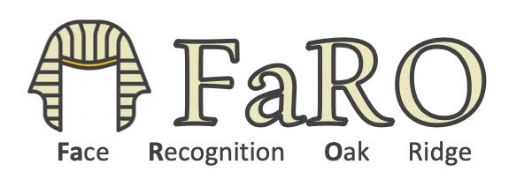

# FARO: Readme

## Overview
Face Recognition from Oak Ridge (FaRO) provides a well-defined server-client 
interface to some of the best open source face recognition projects on the 
web.  The intention is to support an open platform for face recognition research 
and to provide a well-defined and modern baseline for face recognition accuracy.  
While many universities and independent developers have released high quality 
face recognition models, they often lack many useful features such as 
configuration management, easy to use interfaces, deployment tools, backend 
databases, and analysis tools that FaRO provides.
 
In our research we have found that there are many high quality and open source 
face analysis and recognition algorithms available for research; however, 
end-to-end systems that can support larger systems or that can be retrained for niche 
applications are lacking. We hope FARO can fill some of those needs.

The primary goals of this project are:
 1. Create an easy to use foundation that can support complex face recognition systems.
 2. Provide well-defined benchmark algorithms.
 3. Allow for algorithm improvements via open source software and models and to support improvements using techniques like transfer learning. 

FaRO is designed as a client/server system to accomodate the need for high speed GPU 
hardware to support deep learning face processing.  GRPC calls are used to communicate 
with the server components which allows the clients to be written in many languages and 
implemented on a varity of computationally limited platforms such as cellphones or biometric
collection devices.  

## Publications

If you use FARO for publications please cite as:

```
@inproceedings{bolme2020face,
  title={Face Recognition Oak Ridge (FaRO): A Framework for Distributed and Scalable Biometrics Applications},
  author={Bolme, David S and Srinivas, Nisha and Brogan, Joel and Cornett, David},
  booktitle={2020 IEEE International Joint Conference on Biometrics (IJCB)},
  pages={1--8},
  year={2020},
  organization={IEEE}
}
```

## System Requirements:
Many FaRO services should run nicely on limited hardware resources.  As we 
integrate more deep learning algorithms, those may require GPUs and additional 
hardware.

 * Software: python3, venv, cmake, wget
 * Python Libraries: see requirements.txt
 * Optional: NVidia GPU with 8GB of Ram - GTX Titan X/1070/1080 or better 
 * Optional: docker, nvidia-docker2 - supporting Cuda 9.0


## Quick Start

This is intended to get Dlib algorithm up and running quickly.  This is a good 
place to start and will allow you to test the FaRO interface.  A few 
dependencies may be needed on a fresh Ubuntu installation including: cmake, and python3.  The python setup.py file will download and install  other
dependencies in the user directory as well as some large machine learning 
models.  To get some initial dependencies install:

```
$ sudo apt install cmake
$ sudo apt install python3-dev
$ sudo apt install wget
$ sudo apt install protobuf-compiler
```

We recommend using either venv or conda to manage local python environments.

First build the base FaRO environment and compile the proto interfaces. This should be done in a dedicated python environment of your choice. We will use Anaconda for the purposes of our example, but any environment manager can suffice.

```
$ conda create -n faro python=3.8
$ conda activate faro
$ export FARO_STORAGE=~/faro_storage
#Build the protobuf files
$ ./build-proto.sh

#To install the package in-place for development purposes
$ python ./setup.py develop
#To install the package in the dist-packages location
$ python ./setup.py install

```
Next, check which services are available for you to start up, and make sure 'dlib' is within the list:
```
$ python -m faro status --inactive
```
Next, start the FaRO server running dlib as the algorithm under-the-hood. FaRO will build a virtual environment suited for running the algorithm for you:
```
$ python -m faro start --algorithm=dlib --worker-count=2 --service-name=faro_dlib --port=localhost:50030 --mode=venv
```
This will start an instance of a FaRO server and wait for instructions from a FaRO client.

Finally, open a new terminal to connect to the server. 
```
$ conda activate faro
$ python -m faro status -p localhost:50030
```
To try something fun, run a test script that downloads and enrolls presidential faces into a gallery:
```
$ cd ./tests
$ bash ./test_gallery.sh
```


